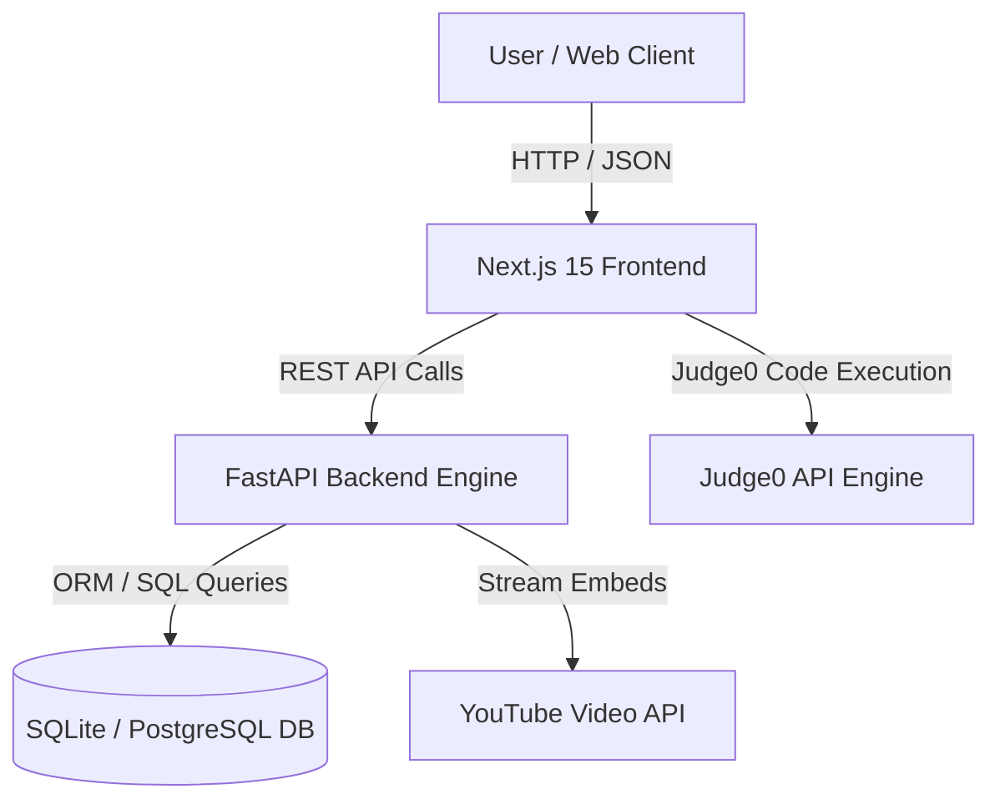
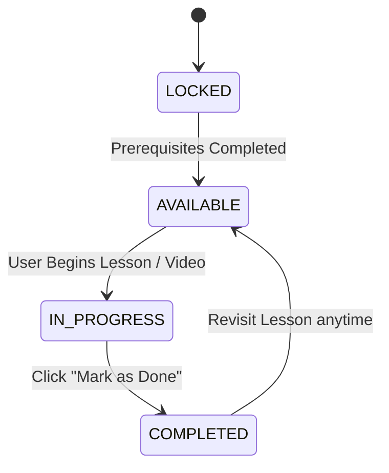

<div align="center">

# ⚔️ DSArena

### **The Ultimate AI-Powered DSA Learning Platform**

*Master Data Structures & Algorithms with structured video lessons, gamified progress tracking, interactive coding workspaces, and adaptive AI mentoring.*

[](https://opensource.org/licenses/MIT)
[](https://www.python.org/)
[](https://fastapi.tiangolo.com/)
[](https://nextjs.org/)
[](https://www.typescriptlang.org/)
[](https://tailwindcss.com/)
[]()
[](#contributing)

[Explore Documentation](#architecture) · [Report Bug](https://github.com/bhuvan-0412/DSArena/issues) · [Request Feature](https://github.com/bhuvan-0412/DSArena/issues)

---

</div>

## 📌 Overview

**DSArena** is an open-source, full-stack educational platform designed to transform computer science students and engineers into confident algorithmic problem solvers.

Learning Data Structures and Algorithms is notoriously difficult. Learners frequently face:
- **Tutorial Hell & Fragmented Resources**: Jumping across disparate YouTube videos, blog posts, and problem sets without a cohesive roadmap.
- **Lack of Structured Progression**: Difficulty tracking prerequisites, missing clear learning paths, or attempting complex problems prematurely.
- **Inconsistent Motivation**: Losing momentum due to lack of immediate feedback, milestone rewards, or gamified progress visualization.

**DSArena solves these challenges** by delivering a unified, step-by-step learning environment. Every topic in the curriculum is paired with high-quality video lessons, prerequisite dependencies, interactive code execution environments, structured learning objectives, and gamified XP rewards.

> [!NOTE]
> **Key Vision**: To build the definitive AI-assisted learning platform for competitive programming and interview preparation, combining structured curriculum progression with real-time feedback and intelligent mentorship.

---

## ⚡ Features

### 🎓 1. Learning & Curriculum Engine
* **Hierarchical Roadmap**: Organizes DSA topics into logical Steps $\rightarrow$ Sections $\rightarrow$ Subsections $\rightarrow$ Topics.
* **Dedicated Lesson Pages**: Centralized two-column interactive lesson interface containing video tutorials, time estimates, difficulty badges, and prerequisite checks.
* **Structured Learning Objectives**: Every lesson outlines *What You Will Learn*, *Why This Topic Matters*, *Real-World Applications*, and *Common Interview Questions*.
* **Sequential Unlocking & Prerequisites**: Prevents premature skipping by enforcing prerequisites. Unlocks subsequent nodes dynamically upon lesson completion.
* **Interactive Roadmap Sidebar**: Live sticky navigation highlighting Completed (✅), Current (▶), and Locked (🔒) nodes with full revisit capability.

### 💻 2. Coding Workspace & Problem Execution
* **Monaco Code Editor**: VS Code-grade editing experience with syntax highlighting, autocomplete, and code folding.
* **Multi-Language Support**: Write, test, and run code in Python, C++, Java, and JavaScript.
* **Code Execution Engine**: Judge0 integration for evaluating test cases, runtime limits, and execution memory.
* **Submission History & Trackers**: Tracks problem-solving duration, submission statuses, and optimal code snippets.

### 📊 3. Analytics, XP & Gamification
* **Gamified Progression**: Earn XP rewards upon completing lessons, submitting code, and solving practice problems.
* **Dynamic Progress Tracking**: Metrics cards for overall roadmap progress (%), completed modules, remaining modules, and estimated time to completion.
* **Streak & Activity Heatmaps**: GitHub-style activity calendar visualizing daily study consistency.
* **Tier & Title Rewards**: Unlock customizable user titles and seasonal pass rewards as mastery increases.

### 🤖 4. AI-Assisted Mentorship *(In Active Development)*
* **Current AI Features**:
  * Automated generation of structured learning objectives and interview questions for roadmap nodes.
  * Adaptive study plan suggestions based on historical performance.
* **Planned AI Features**:
  * **Interactive AI Mentor**: Chat assistant providing hint-based guidance without revealing full solutions.
  * **Automated Code Review**: AI evaluation of time/space complexity and code readability upon submission.

---

## 🖼️ Visual Tour & Screenshots

| Dashboard & Overview | Dedicated Lesson Page |
| :---: | :---: |
|  |  |
| *Personalized dashboard displaying overall progress, study streak, and daily roadmap recommendations.* | *Two-column lesson view featuring video player, learning objectives, prerequisites, and sidebar navigation.* |

| Interactive Coding Workspace | Contest & Analytics Arena |
| :---: | :---: |
|  |  |
| *Monaco Editor with custom test cases, Judge0 code execution, and complexity analysis.* | *Detailed performance graphs, ELO rating updates, and activity heatmaps.* |

---

## 🛠️ Tech Stack

### **Frontend**
* **Framework**: [Next.js 15](https://nextjs.org/) (App Router, React 19)
* **Language**: [TypeScript](https://www.typescriptlang.org/)
* **Styling**: [Tailwind CSS v3.4](https://tailwindcss.com/) with Vanilla CSS custom utilities
* **Icons**: [Lucide React](https://lucide.dev/)
* **Code Editor**: [@monaco-editor/react](https://github.com/suren-atoyan/monaco-react)

### **Backend**
* **Framework**: [FastAPI](https://fastapi.tiangolo.com/) (Python 3.10+)
* **ORM & Database**: [SQLAlchemy 2.0](https://www.sqlalchemy.org/) & [Alembic](https://alembic.sqlalchemy.org/) (Database migrations)
* **API Validation**: [Pydantic v2](https://docs.pydantic.dev/)
* **Web Server**: [Uvicorn](https://www.uvicorn.org/)

### **Database & Authentication**
* **Database**: SQLite (Development) / PostgreSQL (Production ready)
* **Authentication**: Clerk Authentication integration (JWT-based user sessions & fallback mock auth for local development)

---

## 📂 Project Structure

```
DSArena/
├── backend/                        # FastAPI Python Backend
│   ├── alembic/                    # Database migration scripts
│   ├── app/
│   │   ├── api/
│   │   │   ├── endpoints.py        # Core API router aggregator
│   │   │   └── v1/                 # Version 1 API endpoints
│   │   │       ├── adaptive.py     # Adaptive learning endpoints
│   │   │       ├── ai.py           # AI prompt & mentor endpoints
│   │   │       ├── auth.py         # Clerk auth sync endpoints
│   │   │       ├── contest.py      # Virtual contest endpoints
│   │   │       ├── engagement.py   # Daily rewards, chests & streaks
│   │   │       ├── interview.py    # Target company readiness
│   │   │       ├── roadmap.py      # Roadmap nodes, lessons & progress APIs
│   │   │       └── users.py        # User profile & XP management
│   │   ├── core/
│   │   │   ├── config.py           # Application settings & environment vars
│   │   │   └── database.py         # SQLAlchemy engine & SessionLocal setup
│   │   ├── models/                 # SQLAlchemy Database Models
│   │   │   ├── learning_content.py # Resources, concept notes & checklists
│   │   │   ├── progress.py         # User node progress & problem statuses
│   │   │   ├── quiz.py             # Interactive quiz models
│   │   │   ├── roadmap.py          # Hierarchical RoadmapNode & Problem models
│   │   │   └── user.py             # User accounts & XP history
│   │   ├── schemas/                # Pydantic Request/Response Models
│   │   │   ├── roadmap.py          # Lesson, navigation & node schemas
│   │   │   └── user.py             # User profile schemas
│   │   └── services/               # Business logic & external importers
│   │       ├── excel_video_importer.py
│   │       └── striver_importer.py
│   ├── dsarena.db                  # Local SQLite database instance
│   ├── main.py                     # FastAPI application entrypoint
│   └── requirements.txt            # Python dependencies
│
├── frontend/                       # Next.js 15 Frontend
│   ├── src/
│   │   ├── app/
│   │   │   ├── (auth)/             # Authentication route group
│   │   │   ├── (dashboard)/        # Main App Layout Route Group
│   │   │   │   ├── companies/      # Company interview dashboards
│   │   │   │   ├── contests/       # Virtual contest arena
│   │   │   │   ├── dashboard/      # Main student dashboard
│   │   │   │   ├── profile/        # User profile & achievements
│   │   │   │   └── roadmap/        # Interactive roadmap view
│   │   │   │       └── node/[nodeId]/ # Professional Lesson Page
│   │   │   ├── globals.css         # Global Tailwind & dark mode styling
│   │   │   ├── layout.tsx          # Root layout with font configuration
│   │   │   └── page.tsx            # Landing page
│   │   ├── components/
│   │   │   ├── contest/            # Contest cards & leaderboard
│   │   │   ├── engagement/         # Calendar, daily rewards & badges
│   │   │   ├── interview/          # Target company readiness gauges
│   │   │   ├── roadmap/            # Reusable Roadmap & Lesson Components
│   │   │   │   ├── CompletionBanner.tsx
│   │   │   │   ├── CompletionDialog.tsx
│   │   │   │   ├── ContinueLearningButton.tsx
│   │   │   │   ├── LearningObjectivesCard.tsx
│   │   │   │   ├── LessonHeader.tsx
│   │   │   │   ├── LessonNavigation.tsx
│   │   │   │   ├── LessonSidebar.tsx
│   │   │   │   ├── PrerequisiteCard.tsx
│   │   │   │   ├── ProgressCard.tsx
│   │   │   │   └── VideoPlayer.tsx
│   │   │   └── shared/             # Sidebar, Navbar & Providers
│   │   ├── hooks/                  # Custom React hooks (e.g. useAuthUser)
│   │   └── middleware.ts           # Clerk auth route protection
│   ├── package.json                # Node.js dependencies & scripts
│   └── tsconfig.json               # TypeScript compiler config
│
└── README.md                       # Project documentation
```

---

## ⚙️ Installation & Setup Guide

Follow these steps to set up **DSArena** locally on your machine.

### **Prerequisites**
- **Node.js**: v18.0 or higher
- **Python**: v3.10 or higher
- **Git**

---

### **1. Clone the Repository**
```bash
git clone https://github.com/bhuvan-0412/DSArena.git
cd DSArena
```

---

### **2. Backend Setup (FastAPI)**

1. Navigate to the `backend` directory:
   ```bash
   cd backend
   ```

2. Create a virtual environment:
   * **Windows**:
     ```powershell
     python -m venv .venv
     .venv\Scripts\activate
     ```
   * **macOS/Linux**:
     ```bash
     python3 -m venv .venv
     source .venv/bin/activate
     ```

3. Install required Python packages:
   ```bash
   pip install -r requirements.txt
   ```

4. *(Optional)* Set Environment Variables:
   Create a `.env` file inside `backend/`:
   ```env
   PROJECT_NAME="DSArena API"
   DATABASE_URL="sqlite:///./dsarena.db"
   SECRET_KEY="your-super-secret-key-for-jwt"
   ```

5. Initialize Database & Seed Curriculum:
   ```bash
   python seed.py
   ```

6. Start the FastAPI Development Server:
   ```bash
   uvicorn app.main:app --reload --port 8000
   ```
   The backend API will be live at `http://127.0.0.1:8000`. You can inspect interactive API documentation at `http://127.0.0.1:8000/docs`.

---

### **3. Frontend Setup (Next.js)**

1. Open a new terminal and navigate to the `frontend` directory:
   ```bash
   cd frontend
   ```

2. Install Node dependencies:
   ```bash
   npm install
   ```

3. *(Optional)* Configure Environment Variables:
   Create a `.env.local` file inside `frontend/`:
   ```env
   NEXT_PUBLIC_API_URL="http://127.0.0.1:8000/api/v1"
   NEXT_PUBLIC_CLERK_PUBLISHABLE_KEY="your_clerk_publishable_key"
   CLERK_SECRET_KEY="your_clerk_secret_key"
   ```

4. Run the Next.js Development Server:
   ```bash
   npm run dev
   ```

5. Open your browser and navigate to `http://localhost:3000`.

---

## 🚀 Usage Guide

### 1. **Browsing the Roadmap**
- Navigate to the **Roadmap** section from the sidebar.
- Topics are arranged sequentially (Step 1: Learn the Basics $\rightarrow$ Step 2: Sorting Techniques $\rightarrow$ etc.).
- Available nodes appear highlighted; locked nodes remain restricted until prerequisites are met.

### 2. **Learning via Lesson Pages**
- Click on any unlocked topic node (e.g. `User Input / Output` or `Variables`).
- **Watch Lesson**: Stream the embedded video tutorial directly within the page.
- **Review Objectives**: Toggle tabs under **Learning Objectives** to study theoretical key points, real-world engineering uses, and common interview questions.
- **Check Prerequisites**: View prerequisite dependencies required for the current node. Click prerequisite pills to revisit earlier foundational lessons.

### 3. **Marking Completion & Progressing**
- Click **Mark as Done** on the lesson page.
- The system awards **+100 XP**, updates your overall topic completion percentage, and automatically unlocks the next lesson in sequence.
- Click **Continue Learning** to seamlessly navigate to the next unlocked module.

### 4. **Jotting Quick Notes**
- Use the built-in **Quick Notes** notepad on the right sidebar of any lesson page to write key formulas, complex edge cases, or revision code snippets.

---

## 🗺️ Project Roadmap & Milestones

Below is the current development state of **DSArena**:

- [x] **Phase 1: Core Curriculum & Roadmap Engine**
  - [x] Hierarchical roadmap database schema (`Step` $\rightarrow$ `Section` $\rightarrow$ `Topic` $\rightarrow$ `Problem`).
  - [x] Embedded YouTube video learning integration.
  - [x] Sequential locking & dynamic prerequisite unlocking.
  - [x] Dedicated 2-column interactive lesson pages (`/roadmap/node/[nodeId]`).

- [x] **Phase 2: Gamification & Engagement Systems**
  - [x] XP earning system & user profile levels.
  - [x] Interactive study calendar & activity heatmaps.
  - [x] Daily login rewards, chest openings & user title equips.

- [ ] **Phase 3: Interactive Coding & Quiz Engine**
  - [ ] Monaco code editor & Judge0 multi-language execution.
  - [ ] Interactive MCQs & problem concept quizzes.
  - [ ] Submission memory/time complexity analytics.

- [ ] **Phase 4: AI Mentor & Mock Interviews**
  - [ ] Real-time conversational AI mentor with hint-based guidance.
  - [ ] Target company readiness evaluation & mock technical interviews.

---

## 🏗️ Architecture & Learning Flow

DSArena follows a decoupled Client-Server architecture:



### **Learning State Machine**


---

## 🗄️ Database Models

DSArena's database is powered by SQLAlchemy models:

* **`RoadmapNode`**: Polymorphic model storing steps, sections, topics, and problem nodes. Contains `title`, `slug`, `order_index`, `estimated_time`, `difficulty`, `youtube_video_id`, `prerequisites` (JSON), and `metadata` (JSON).
* **`UserNodeProgress`**: Stores user progress per node (`status` $\in$ {`LOCKED`, `AVAILABLE`, `IN_PROGRESS`, `COMPLETED`}, `completed_at`, `started_at`).
* **`UserProgress`**: Tracks individual coding problem submissions (`status` $\in$ {`NOT_STARTED`, `ATTEMPTED`, `SOLVED`, `MASTERED`}, `code`, `language`, `solving_time_seconds`).
* **`User`**: Manages user accounts, Clerk IDs, total XP, current level, equipped titles, and streak statistics.

---

## 📡 API Specification Summary

FastAPI exposes clean RESTful JSON endpoints. Full OpenAPI specification available at `/docs` when running the backend.

### **Roadmap & Lessons**
* `GET /api/v1/roadmap/nodes` - Fetch complete roadmap node tree with progress.
* `GET /api/v1/roadmap/nodes/{node_id}` - Fetch rich lesson details, video info, and learning objectives.
* `GET /api/v1/roadmap/nodes/{node_id}/previous` - Fetch immediate previous lesson.
* `GET /api/v1/roadmap/nodes/{node_id}/next` - Fetch immediate next lesson.
* `GET /api/v1/roadmap/nodes/{node_id}/navigation` - Unified navigation payload.
* `POST /api/v1/roadmap/nodes/{node_id}/complete` - Complete lesson, award XP, and unlock next node.

---

## 🛠️ Development Workflow

### **Branch Naming Conventions**
* `feature/feature-name` (e.g. `feature/lesson-sidebar`)
* `fix/bug-name` (e.g. `fix/navigation-lock`)
* `docs/documentation-update`

### **Commit Message Format**
We follow standard Conventional Commits:
```bash
feat: transform roadmap nodes into professional lesson pages
fix: resolve prerequisite locking check for initial node
docs: update architecture diagram in README
```

---

## 🤝 Contributing

We welcome contributions from the open-source community!

1. **Fork the Repository**
2. **Create a Feature Branch**:
   ```bash
   git checkout -b feature/amazing-feature
   ```
3. **Commit your Changes**:
   ```bash
   git commit -m "feat: add amazing feature"
   ```
4. **Push to the Branch**:
   ```bash
   git push origin feature/amazing-feature
   ```
5. **Open a Pull Request**

---

## 🔮 Future Scope

- **AI Mentor Integration**: Real-time LLM-powered mentor guiding users through difficult algorithmic concepts without spoiling code solutions.
- **Adaptive Learning Engine**: Dynamically recommends target revision problems based on spaced repetition algorithms.
- **Peer vs. Peer Arena**: Real-time 1v1 coding battles with live ratings and leaderboards.

---

## 📄 License

Distributed under the **MIT License**. See `LICENSE` for more information.

---

## 👏 Credits

DSArena's structured curriculum and topic hierarchy draw inspiration from **Striver's A2Z DSA Sheet** by Take U Forward. 

> [!IMPORTANT]
> **Disclaimer**: **DSArena** is an independent, open-source educational platform developed to enhance structured Data Structures & Algorithms learning through interactive lesson pages, progress tracking, gamification, and AI-assisted tools. It is not officially affiliated with or endorsed by Take U Forward or any third-party content creator.

---

## 🙏 Acknowledgements

* [FastAPI](https://fastapi.tiangolo.com/) - High-performance Python web framework
* [Next.js](https://nextjs.org/) - The React Framework for the Web
* [Tailwind CSS](https://tailwindcss.com/) - Utility-first CSS framework
* [Lucide Icons](https://lucide.dev/) - Beautiful & consistent icons
* [Monaco Editor](https://microsoft.github.io/monaco-editor/) - The code editor that powers VS Code

---

## 📫 Contact & Community

* **GitHub**: [bhuvan-0412/DSArena](https://github.com/bhuvan-0412/DSArena)
* **Issue Tracker**: [Report Bugs & Request Features](https://github.com/bhuvan-0412/DSArena/issues)
* **Discussions**: [Community QA & Ideas](https://github.com/bhuvan-0412/DSArena/discussions)

<div align="center">
  <sub>Built with ❤️ by the DSArena Open Source Team.</sub>
</div>
